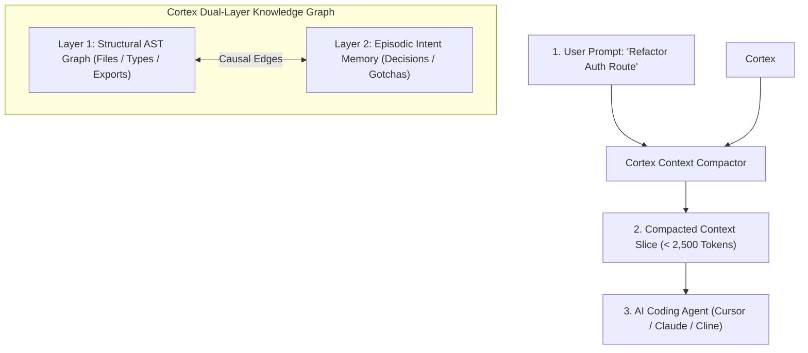

# Cortex

> **Dual-Layer Codebase Knowledge Graph & Episodic Memory Engine for AI Coding Agents.**

[](https://opensource.org/licenses/MIT)
[](https://www.typescriptlang.org/)
[](https://modelcontextprotocol.io/)

---

## What is Cortex?

AI coding agents (Claude Desktop, Cursor, Cline, Devin) suffer from **context amnesia**:
1. **Context Window Decay**: Multi-turn debugging sessions truncate past messages, causing the agent to forget earlier architectural decisions, failed attempts, and project rules.
2. **Context Bloat & Token Burn**: Ingesting entire codebases (50,000+ tokens) into every prompt causes attention dilution, slow inference, and high API costs.
3. **Flat Search Blindness**: Traditional text search (`grep`) and flat vector embeddings do not understand code hierarchy or why past changes were made.

**Cortex** solves this by constructing a local, self-evolving **Dual-Layer Knowledge Graph** that sits directly in your repository:
- **Layer 1 (Structural Codebase Topology)**: AST symbol interfaces, exports, imports, and cross-file dependencies.
- **Layer 2 (Episodic Intent Memory)**: Verified architectural decisions, gotchas, user invariants, and past bug-fix constraints.

When an agent executes a prompt, Cortex extracts a 2-hop causal subgraph and compresses it into a laser-focused **`< 2,500` token Context Slice**, achieving a **97% reduction in context window footprint**.



---

## Core Capabilities

- **Sub-2.5k Token Context Compactor**: Converts 50k+ tokens of raw file churn into an ultra-dense, deterministic context slice containing exact blueprints, interfaces, and past decisions.
- **Append-Only Event Ledger**: Memory updates record to chronological delta logs in `.cortex/ledger/`. Multiple developers and branches merge in Git with zero merge conflicts.
- **3-Tier Verification Protocol**: New agent insights start in tentative status and are promoted to verified status only when test suites pass (`exit code 0`), preventing hallucinated notes from poisoning memory.
- **Dynamic Blast Radius Calculator**: Maps direct and indirect downstream file dependencies before an agent performs breaking refactors.
- **Drop-in Model Context Protocol (MCP)**: Native stdio server compatible with Claude Desktop, Cursor IDE, Cline, and Windsurf.

---

## Quickstart

### 1. Initialize Cortex in Your Repository
```bash
npx cortex-memory init
```
This scans your codebase AST, detects your framework, extracts design system invariants, and writes `.project-cortex.json`.

### 2. Query Compact Context Slice
```bash
npx cortex-memory context "auth.service.ts"
```

### 3. Record an Architectural Decision
```bash
npx cortex-memory decision "Token Revocation Strategy" "Use Redis key TTL of 86400s instead of Postgres query." src/services/auth.ts src/db/redis.ts
```

### 4. Calculate Downstream Blast Radius
```bash
npx cortex-memory blast src/db/postgres.ts
```

---

## Model Context Protocol (MCP) Integration

Add Cortex to your `claude_desktop_config.json` or `.cursor/mcp.json`:

```json
{
  "mcpServers": {
    "cortex-memory": {
      "command": "npx",
      "args": ["-y", "cortex-memory", "mcp"]
    }
  }
}
```

### Exposed MCP Tools:
- `cortex_get_context`: Returns a compacted `< 2,500` token markdown slice for a prompt or file query.
- `cortex_record_decision`: Saves an architectural decision attached to affected files in project memory.
- `cortex_record_gotcha`: Records an edge-case warning or constraint to prevent repeating mistakes.
- `cortex_blast_radius`: Analyzes upstream and downstream affected files before code refactoring.
- `cortex_sync`: Re-indexes AST to synchronize with recent code edits.

---

## Architecture Overview

```
.
├── .cortex/
│   ├── graph.json            # Active Knowledge Graph cache
│   └── ledger/               # Append-only chronological delta logs (Git-safe)
├── bin/
│   └── cortex.js             # CLI Entrypoint
├── src/
│   ├── ast/                  # Tree-sitter & AST code scanner
│   ├── graph/                # Dual-layer graph engine & context compactor
│   ├── mcp/                  # Model Context Protocol stdio server
│   └── cli.ts                # Command line interface
├── web/                      # Interactive Visualizer Studio & Landing Page
└── package.json
```

---

## License

MIT License (c) 2026 Bhavuk Arora. Designed for autonomous software engineering.
